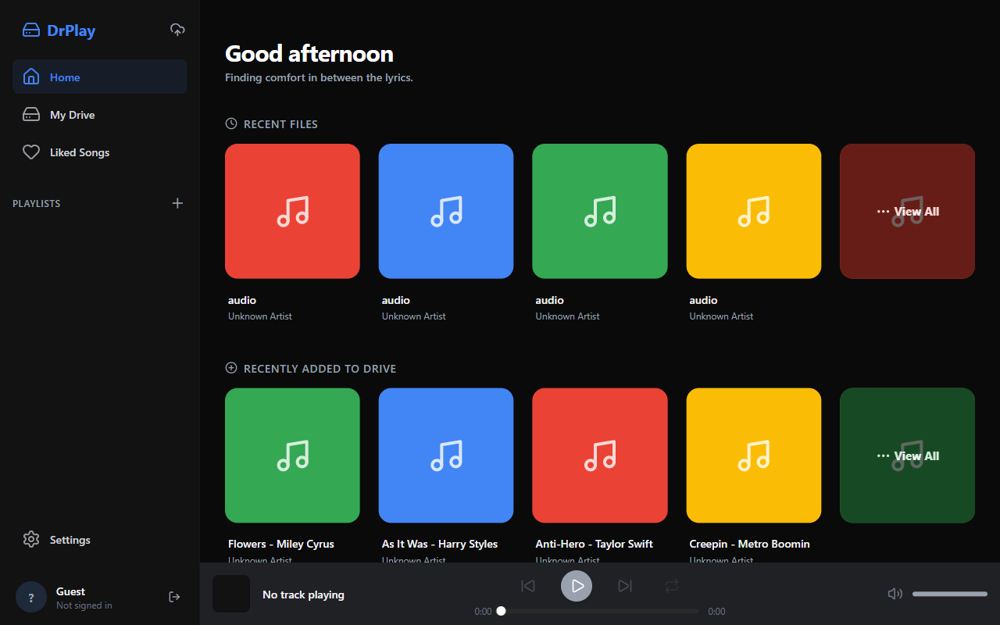
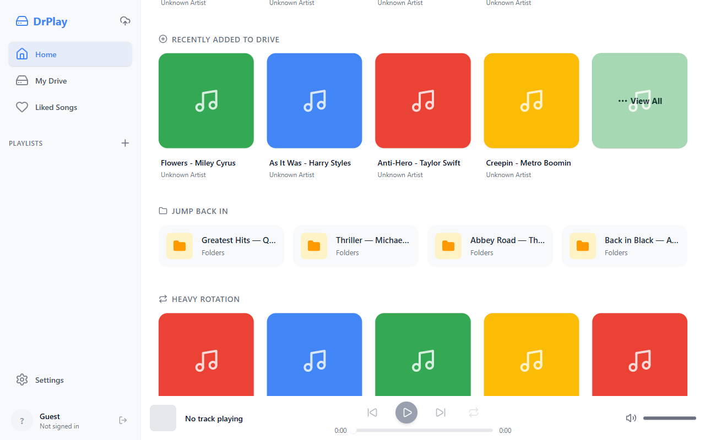
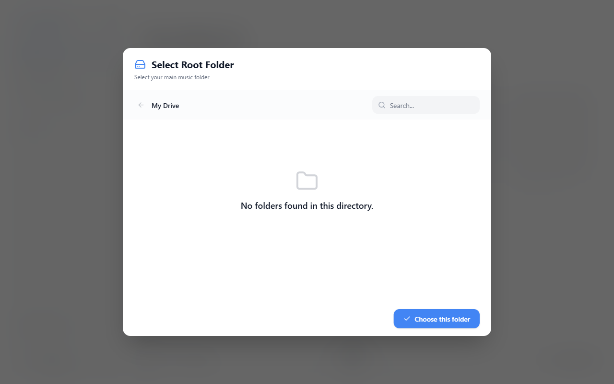
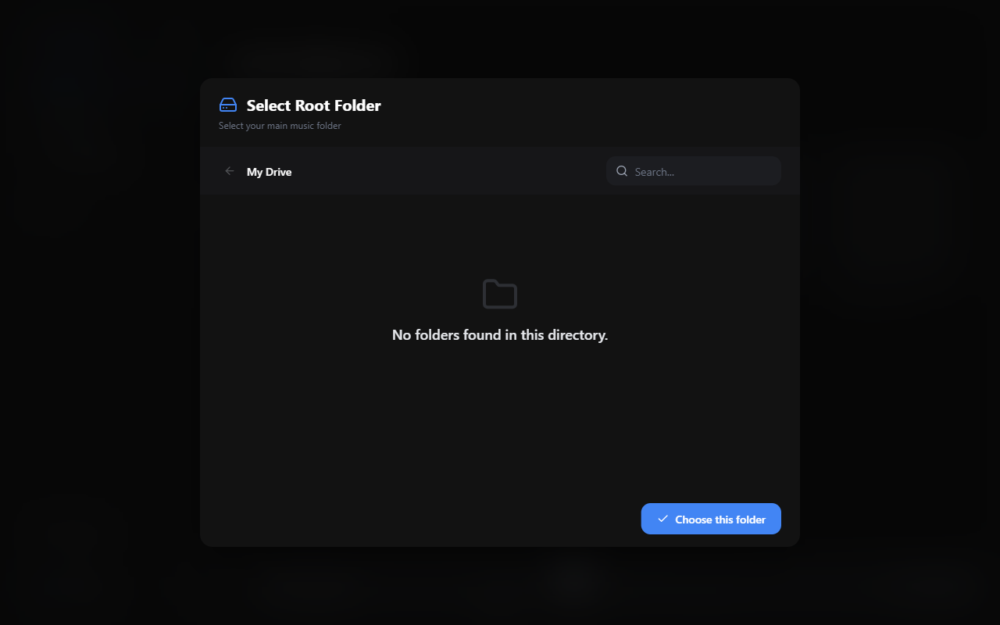

# DrPlay

**A desktop music player for your Google Drive — stream your own library, privately, on your own machine.**

[](https://tauri.app)
[](https://react.dev)
[](https://www.typescriptlang.org)
[](#testing)




<p align="center">
  
  
</p>

> Screenshots are demo captures (mock library data). My Drive screens will be
> added once a real capture with actual account data is available.

DrPlay is a **Windows desktop app** (Windows 10 and later) that turns your **Google Drive** into a music library. No downloading hundreds of gigabytes first — it streams straight from Drive, builds your library locally, and keeps everything on your machine.

---

## Features

- **Stream directly from Drive** — playback proxies straight to `googleapis.com` through an in-app service worker (`/drive-stream/`), with buffer + prefetch for shaky connections
- **Home for your library** — greeting, Recent Files, Recently Added, Heavy Rotation, Discover, Jump Back In (`src/ui/HomeTab/`)
- **Full My Drive explorer** — virtualized list (smooth even with thousands of files), folder navigation, breadcrumbs, search, sort, pagination
- **Selection & bulk ops** — multi-select, bulk move / delete, create folder, upload files & folders (drag-drop), download (`src/ui/MainContent/`, `src/hooks/useMenuDownload.ts`)
- **Player** — play/pause, seek, volume, shuffle, repeat, queue (`src/ui/PlayerBar/`, `src/hooks/player/`)
- **Liked songs & playlists** — fully stored on-device (`src/ui/LikedSongs/`, `src/ui/Playlist/`)
- **Metadata & covers** — ID3 tags read locally, cover thumbnails generated and cached (`src/utils/metadata.ts`, `src-tauri/src/cover.rs`, `thumbnail.rs`)
- **Trash manager** — restore or permanently delete from Drive (`src/ui/Settings/TrashScreen.tsx`)
- **Background sync** — a worker keeps "Recently Added" fresh without reloads (`src/workers/proSync.worker.ts`)
- **Settings** — light/dark theme, English / Tiếng Việt (i18n), download path, minimize-to-tray, cache manager, error log viewer (`src/ui/Settings/`)

## Quick start

### Requirements

- **Windows 10 or later** (WebView2 runtime — preinstalled on Windows 11, auto-installed with the app on Windows 10)
- **Node.js** ≥ 20 + npm (for development)
- **Rust toolchain** (stable) — Tauri v2 backend (for development)
- A **Google Drive** account

### 1. Clone & install

```bash
git clone https://github.com/auhsuai/drplay.git
cd drplay
npm install
```

### 2. Set up Google OAuth credentials

DrPlay needs a Google **Desktop-app OAuth client**:

1. Go to [Google Cloud Console](https://console.cloud.google.com/apis/credentials) → create credentials → **OAuth client ID** → type **Desktop app**
2. Download the JSON, save it in the **repo root** as `wa_credential.json` (gitignored — never commit it)

```json
{
  "installed": {
    "client_id": "xxxx.apps.googleusercontent.com",
    "client_secret": "xxxx"
  }
}
```

### 3. Run

```bash
npm run tauri dev      # dev build (hot reload)
npm run tauri build    # release bundle (dist/)
npm test               # unit tests (vitest, 960+ passing)
```

> Tip: `npm run dev` starts the Vite server only (port 1420) — most UI work can be iterated in a browser before touching Tauri.

## Architecture

```
┌──────────────────────────────────────────────────┐
│  Frontend · React 19 + TypeScript (src/)          │  UI, hooks, utils, Dexie DB
└───────┬──────────────────────────────┬───────────┘
        │ Tauri IPC (invoke)           │ /drive-stream/ (service worker)
┌───────▼──────────────────┐   ┌───────▼──────────────────────────┐
│  Backend · Rust (src-    │   │  Service worker (public/sw.js)    │
│  tauri/) — OAuth, key-   │   │  proxies audio to Google Drive   │
│  ring, covers, tray      │   └───────────────┬──────────────────┘
└───────┬──────────────────┘                   │
        │ HTTPS (Google APIs only — enforced by CSP)
┌───────▼──────────────────────────────────────┐
│           Google Drive (your account)         │
└───────────────────────────────────────────────┘
```

- **Frontend** — React 19 + Vite + TypeScript; local data in **IndexedDB (Dexie)**; virtualized lists for large folders
- **Backend (Rust/Tauri)** — OAuth native login, refresh-token **OS keyring**, cover/thumbnail cache, tray (`src-tauri/src/`)
- **Streaming** — the service worker proxies `/drive-stream/{fileId}` to `drive/v3/files?alt=media` with the Bearer token held **in memory only**
- **No developer server exists** — the app only talks to Google APIs (CSP allows exactly: `googleapis.com`, `oauth2.googleapis.com`, `*.googleusercontent.com`)

## Security

- **OAuth best practices**: PKCE + CSRF state + dynamically-bound loopback port (no fixed-port race); scope is `drive` (needed for create/move/delete/upload across your Drive)
- **Refresh token → OS keyring** (Windows Credential Manager), never localStorage; errors never contain the token
- **Access token** short-lived (~50 min) in localStorage; auto-refresh with 401 retry, bounded timeout
- **Logout revokes both tokens** via Google's revoke endpoint and wipes the keyring
- **CSP locked down**: `script-src 'self'`, `base-uri 'none'`, `frame-ancestors 'none'`, `object-src 'none'` — no remote content, no iframes
- **No telemetry**: no analytics SDKs, no tracking; `console.*` output is redacted (token/Bearer/IDs) in dev and silenced in production
- **Supply chain**: `npm audit` clean, lockfile committed

## Project structure

```
src/                  React frontend
  ui/                 Screens & components (HomeTab, MainContent, PlayerBar, Settings…)
  hooks/              React hooks (auth, player, drive explorer…)
  utils/              apiClient, driveApi, metadata, streamPrefetcher, keyring bridge…
  db/                 Dexie schema
src-tauri/            Rust backend (auth, token_store, cover, thumbnail, tray)
public/sw.js          Service worker audio-stream proxy
docs/                 Screenshots & docs
```

## FAQ

**Why does the app need full Drive access?** DrPlay lets you create/move/delete files and folders and upload from any folder in your Drive — that requires the `drive` scope. It never scans or uploads anything outside the folder you pick as your library.

**Is my listening history uploaded anywhere?** No. History, playlists, likes, metadata cache — all stay in IndexedDB on your machine.

**Can I play a song offline?** Streaming requires connectivity to Google; downloaded files (Settings → download path) are yours to keep.

**Found a network request to a domain not listed in Security above?** That's a bug — please open an issue.

## Contributing

PRs welcome. Local conventions:

- Tests first (TDD), `npm test` must stay green
- TypeScript strict, no `any`
- Follow existing patterns in `src/utils/` for error handling (typed catch, contextual logging, no secrets in logs)
- Lint & format before committing: `npm run lint`, `npm run format`

## License

Currently unlicensed — see the repo owner for usage terms.
